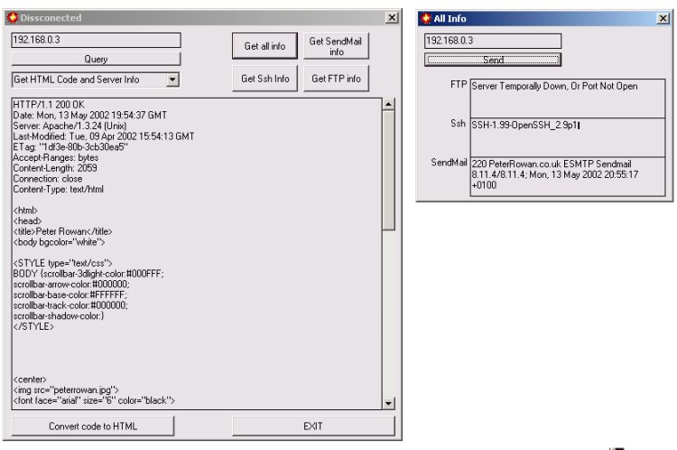



## Get server Information

### Description

This little beast can grab lots of vital security information about servers. For example, you might want to know what versions of sendmail, Ssh, FTP, or http is running. Well insted of finding out yourself by going though each one (very time comsuming) this program does it all in under a few seconds!!!

Shows the HTTP headers, what version of ssh, sendmail, and FTP. Uses Winsock
 
### More Info
 

             |
---                |---
**Submitted On**   |2002-05-13 20:53:20
**By**             |[Peter Rowan](https://github.com/Planet-Source-Code/PSCIndex/blob/master/ByAuthor/peter-rowan.md)
**Level**          |Intermediate
**User Rating**    |5.0 (15 globes from 3 users)
**Compatibility**  |VB 5\.0, VB 6\.0
**Category**       |[Internet/ HTML](https://github.com/Planet-Source-Code/PSCIndex/blob/master/ByCategory/internet-html__1-34.md)
**World**          |[Visual Basic](https://github.com/Planet-Source-Code/PSCIndex/blob/master/ByWorld/visual-basic.md)
**Archive File**   |[Get\_server826785132002\.zip](https://github.com/Planet-Source-Code/peter-rowan-get-server-information__1-34760/archive/master.zip)

